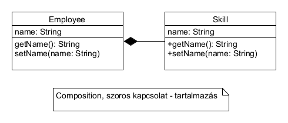

# Main

```java
public static void main(String[] args) {

}
```

# Értékek beolvasása

```java
Scanner scanner = new Scanner(System.in);

System.out.println("What's your name?");
String name = scanner.nextLine();

System.out.println("What's your year of birth?");
int yearOfBirth = scanner.nextInt();
```

Vigyázz a `nextInt()` metódussal, mert az nem olvassa
be a sorvége jelet, és a következő `nextLine()`
nem fog működni.

```java
int age = scanner.nextInt();
scanner.nextLine(); //Ez fogja az ottmaradt sorvége jelet beolvasni
        
String name = scanner.nextLine();
```

Helyette jobb lehet a következő (`NumberFormatException` kivételt dob, ha nem szám):

```java
String line = scanner.nextLine();
int age = Integer.parseInt(line); // Exception-t 
```

# UML



# Számok

```java
boolean even = i % 2 == 0; // Páros?

double quotient = 10 / 4; // 2.0 - egészosztás
```

# Típuskényszerítés, autoboxing, String műveletek

```java
double d = 12;         // int -> double implicit
int i = (int) 3.14; // double -> int kényszerítéssel, értéke 3
```

```java
Integer i = 12; // int -> Integer autoboxing
int j = i; // Integer -> int autoboxing
```

```java
int i = Integer.parseInt("12"); // Parse
double d = Double.parseDouble("12.1") // Parse

String si = Integer.toString(12); // toString
String di = Double.toString(d); // toString
```

# Stringműveletek

```java
boolean eq = name.equals(anotherName);                // Egyenlőségvizsgálat

String fruit = "Apple";
int position = fruit.indexOf("pp");                   // 1 (ha nem találja, -1)

int length = fruit.length()                           // 5 (hossza)

String sub = fruit.substring(1, 4);                   // ppl (1. indexű bekerül, 4. indexű nem kerül bele)

String upper = fruit.toUpperCase();                   // APPLE

boolean empty = fruit.isEmpty();                      // false, üres string esetén true
boolean blank = fruit.isBlank();                      // false, ha csak whitespace karaktereket tartalmaz, akkor true

boolean startsWith = fruit.startsWith("app");         // true
boolean endWith = fruit.endsWith("le");               // true
boolean containsDoubleP = fruit.contains("pp");       // true
String part = fruit.substring(0, 2).toLowerCase();    // ap - összefűzhetők
```

Daraboljunk!

```java
String s = "John;1980";
String[] parts = s.split(";"); // ; a separator karakter
String name = parts[0];
int yearOfBirth = Integer.parseInt(parts[1]);
```

Járjuk be karakterenként!

```java
String s = "abcd";
for (char c: s.toCharArray()) {
    System.out.println(Character.isLetter(c));
}
```

Hosszú string összefűzése:

```java
StringBuilder sb = new StringBuilder();
for (int i = 0; i < 10; i++) {
    sb.append(i).append(" * ").append(i).append(" = ").append(i * i);
}
```

Formázás:

```java
String formatted = String.format("Name: %s, year of birth: %d", employee.getName(), employee.getYearOfBirth());
    // Name: John Doe, year of birth: 1980

// Vagy azonnal kiírva:
System.out.printf("Name: %s, year of birth: %d", employee.getName(), employee.getYearOfBirth());
```

# Dátumok

```java
LocalDate fromDate = LocalDate.of(2015, Month.JANUARY, 30);

LocalDateTime fromDateTime = LocalDateTime.of(2015, 1, 20, 10, 15);
```

# Ciklusok

Klasszikus for ciklus. Csak akkor használjuk ezt, ha
szükségünk van a ciklusváltozóra.

```java
for (int i = 0; i < 10; i++) {
    System.out.println(i);
}
```

Un. for-each ciklus, használjuk mindig ezt, ha lehet!

```java
List<String> names = List.of("John Doe", "Jack Doe");

for (String name: names) {
    System.out.println(name);
}
```

# Tömbök

Lehetőleg kerüljük, helyette használjunk listát!
Néhány helyen elkerülhetetlen, pl. varargs, 
`split()` vagy ha a feladat így kéri.

```java
int[] numbers = new int[10];

int[] names = new String[]{"John", "Jack"};

int length = names.length;

for (String name: names) {
    System.out.println(name);
}
```

# Listák

```java
List<String> names = List.of("John", "Jack"); // Módosíthatatlan lista

List<String> moreNumbers = new ArrayList<>(); // Módosítható lista, diamond operátor, primitív típus nem lehet

List<String> copy = new ArrayList<>(numbers); // Módosítható másolat

copy.add("Jane"); // ["John", "Jack", "Jane"] - hozzáadás
copy.remove("John"); // ["Jack", "Jane"] - eltávolítás

boolean containsJohn = names.contains("John"); // false - nincs benne

int size = names.size(); // 2 - hossza

int indexOfJane = names.indexOf("Jane") // 1 - 1. indexen

for(String name: names){
    System.out.println(name);
}
```

# Véletlenszám

```java
Random rnd = new Random();
int randomNumberTo10 = rnd.nextInt(10); // 0 - 9-ig generálhat számokat, 10-et sosem generál
```

# Felsorolásos típus

```java
public enum Coin {
    TWOHUNDRED, HUNDRED, TWENTY, TEN, FIVE
}
```

# JUnit

```java
public class TestCalculator {

    void testAdd() {
        // Given
        Calculator calculator = new Calculator();
        // When
        int result = calculator.add(2, 3);
        // Then
        assertEquals(5, result);
    }
}
```

# Kivételkezelés

```java
try {    
     int result = a / b;
     // Ha nincs hiba
     System.out.println("A hányados alsó egészrésze: " + result);
} catch (ArithmeticException ae) {
    // Ha van hiba
    throw new IllegalArgumentException("Arithmetic error", ae);
} 
finally {
    // Minden esetben lefut
    System.out.println("Finally");
}
```

# Összegzés tétele

Listában szereplő számok összege

```java
public int sum(List<Integer> numbers) {
    int sum = 0;
    for (Integer n: numbers) {
        sum += n;
    }
    return sum;
}
```

# Számlálás tétele

A stringben szereplő `b` betűk száma:

```java
public int countLetterB(String s) {
    int count = 0;
    for (char c: s.toCharArray()) {
        if (c == 'b') {
            count++;
        }
    }
    return count;
}
```

# Szélsőérték keresés tétele

Listában szereplő legnagyobb szám:

```java
public int max(List<Integer> numbers) {
    int max = Integer.MIN_VALUE;
    for (Integer n: numbers) {
        if (n > max) {
            max = n;
        }
    }
    return max;
}
```

# Eldöntés tétele

Csak 100-nál nagyobb számokat tartalmaz?

```java
public boolean containsGreaterThanHundred(List<Integer> numbers) {
    for (Integer i : numbers) {
        if (i > 100) {
            return true;
        }
    }
    return false;
}
```

# Szűrés

Csak a száznál nagyobb számok listáját adja vissza:

```java
public List<Integer> greaterThanHundred(List<Integer> numbers) {
    List<Integer> filtered = new ArrayList<>();
    for (Integer i : numbers) {
        if (i > 100) {
            filtered.add(i);
        }
    }
    return filtered;
}
```

# Transzformáció

Csak a neveket adja vissza:

```java
public List<String> getNames(List<Employee> employees) {
    List<String> names = new ArrayList<>();
    for (Employee employee: employees) {
        names.add(employee.getName());
    }
    return names;
}
```

# Szöveges fájl beolvasása soronként

```java
public class FileReader {

    public List<String> readLines(BufferedReader reader) throws IOException {
        String line;
        while ((line = reader.readLine())  != null) {
            System.out.println(line);
        }
    }        

    public static void main(String[] args) {
        try (BufferedReader reader = Files.newBufferedReader(Path.of("data.csv"))) {
            new FileReader().readLines(reader);
        } catch (IOException ioe) {
            throw new IllegalStateException("Can not read file", ioe);
        }
    }
}
```

Ugyanez classpathról:

```java
try (BufferedReader reader = new BufferedReader(new InputStreamReader(FileReader.class.getResourceAsStream("data.csv")))) {
    new FileReader().readLines(reader);
} catch (IOException ioe) {
    throw new IllegalStateException("Can not read file", ioe);
}
```

# Szöveges állomány kiírása soronként

```java
public class FileWriter {

    public void writeLines(List<String> employees, BufferedWriter writer) {
        try {
            for (String employee : employees) {
                writer.write(employee.getName() + "," + employee.getYearOfBirth());
            }
        } catch (IOException ioe) {
            throw new IllegalStateException("Can not read file", ioe);
        }
    }

    public static void main(String[] args) {
        try (BufferedWriter writer = Files.newBufferedWriter(Path.of("data.csv"))) {
            new FileWriter().writeLines(writer);
        } catch (IOException ioe) {
            throw new IllegalStateException("Can not write file", ioe);
        }
    }
}
```

# Set

```java
Set<String> names = new HashSet<>();
names.add("John");
names.add("Jack");
names.add("John");
System.out.println(names); // [John, Jack]

names.remove("John");

boolean contains = names.contains("Jack"); // true

for (String name: names) {
    System.out.println(name);
}
```

# Map

```java
Map<String, String> words = new HashMap<>();
words.put("apple", "alma");
words.put("peer", "körte");

System.out.println(words.get("apple")); // alma

words.put("apple", "Apfel"); // Felülírja az értéket
System.out.println(words.get("apple")); // Apfel

Set<String> keys = words.keySet(); // Kulcsok
Collection<String> values = words.values(); // Értékek

for (Map.Entry entry: words.entrySet()) {
    System.out.println(entry.getKey() + " - " + entry.getValue());
}
```

# Számlálás Map-pel

Számoljuk meg, melyik betűből mennyi van egy Stringben!

```java
String s = "alma mater";
Map<Character, Integer> countOfLetters = new HashMap<>();
for (char c: s.toCharArray()) {
    if (countOfLetters.containsKey(c)) {
        countOfLetters.put(c, countOfLetters.get(c) + 1);
    }
    else {
        countOfLetters.put(c, 1);
    }
}
System.out.println(countOfLetters); // { =1, a=3, r=1, t=1, e=1, l=1, m=2}
int numberOfM = countOfLetters.get('m'); // 2
```

# Lista rendezése

```java
List<Integer> numbers = new ArrayList<>(List.of(6, 5, 8, 3));
Collections.sort(numbers);

// Figyelembe veszi az ékezeteket
List<String> names = new ArrayList<>(List.of("Benjámin", "Áron", "József", "Arnold"));
Collections.sort(names, Collator.getInstance(new Locale("hu", "HU")));

List<Employee> employees = List.of(
        new Employee("John Doe", 1980),
        new Employee("Jack Doe", 1970));

// Év vagy név szeretnénk rendezni
Collections.sort(employees, new Comparator<Employee>() {
    @Override
    public int compare(Employee o1, Employee o2) {
        // return o1.getYearOfBirth() - o2.getYearOfBirth();
        return o1.getName().compareTo(o2.getName());
    }
});
```