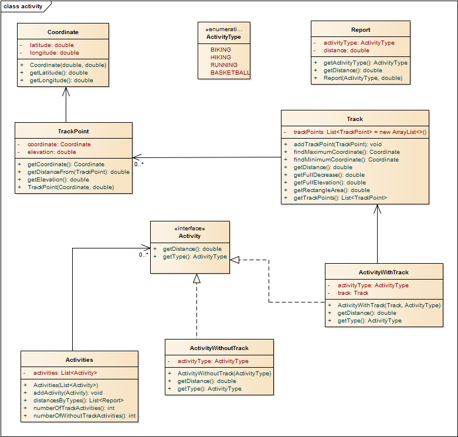

# Activity projekt

A feladatban egy úgynevezett Activity Tracker alkalmazás szimulációját kell 
megvalósítani, mellyel nyilvántarthatjuk sportolási tevékenységeinket, és lekérdezhetjük 
eredményeinket.

Különböző sportolási tevékenységek (activity) vannak, mint a kerékpározás, túrázás, kosárlabda, stb.
Ezek közül vannak olyanok, melyekhez tartozhat út (track), és van, amelyhez nem. Az út útpontokból (trackpoint)
áll. Egy útpont tartalmaz koordinátákat és magasságot. A tevékenységeket listában kell tárolni, és
különböző műveleteket kell ezekkel végezni.

 
A megvalósításhoz a következő elemeket kell implementálni:

* `ActivityType` enum:
   Négy féle típus lehet: `BIKING`,`HIKING`,`RUNNING`,`BASKETBALL`. Fontos, hogy
   ebben a sorrendben.

* `Activity` interface:
   Két metódusa van a `getDistance()` amivel az adott sport közben megtett távot
   tudjuk lekérdezni, valamint a `getType()`, amivel a tevékenységünk típusát kaphatjuk meg.

* `Coordinate` immutable osztály:
   Két adattagja van: a szélességi és hosszúsági fok (latitude,longitude), előbbi
   az értéke [-90,90] intervallumon, utóbbi értéke a [-180,180] intervallumon mozoghat.
   Mindkét adattaghoz tartozik egy getter.

* `TrackPoint` osztály:
   Van egy koordináta és egy emelkedés adattagja. Tartalmaz egy `getDistanceFrom(TrackPoint point)` 
   metódust mely, egy másik ponttól vett távolságot adja vissza. A földrajzi koordinátákkal való számoláshoz
   segítségül:
   http://stackoverflow.com/questions/3694380/calculating-distance-between-two-points-using-latitude-longitude-what-am-i-doi
   
* `Track` osztály:
   `TrackPoint`-ok listáját tárolja. Le lehet kérdezni az összemelkedést, az össztávolságot.
   Valamint a pontokat, mint függvényt elképzelve a bennfoglaló téglalap területét.
   
   Írj egy `loadFromGpx()` metódust is, mely egy szabványos GPX fájlt tölt be!
   Itt azt figyeld, hogy a sor a `<trkpt` és `<ele` szöveggel kezdődik-e!
   Itt beégetheted, hogy a számok hanyadik karaktertől hanyadik karakterig tartanak.
   Egy `Coordinate` példányt hozz létre, ha belefutsz a `<trkpt` sorba!
   Egy `TrackPoint` példányt hozz létre, ha belefutsz a `<ele` sorba, és add hozzá
   a listához! Egy példa állományt az `src/test/resources` könyvtárban találsz.

* `ActivityWithTrack` osztály:
   Implementálja az `Activity` interface-t. Van egy `Track` addattagja. A `getDistance()` metódus
   a megadott track össztávolságát adja vissza míg a `getType()` a típust.

* `ActivityWithoutTrack` osztály:
   Implementálja az `Activity` interface-t. Mivel itt nincs track adattag, ezért a `getDistance()` 
   mindig nullát ad vissza. A típus hasonló, mint az előző osztályban.
   
* `Activities` osztály:
   `Activity`-k listáját tartalmazza. Le lehet kérdezni a track-es illetve a track nélküli
   listaelemeket. Valamint típusonként külön-külön a távolságot egy `Report`-okat tartalmazó listába.

   
* `Report` osztály:
   Egy immutable osztály melynek egy típus és egy távolság adattagja van.
   
<!-- [rating feedback=java-activity] -->   
  
   
   
