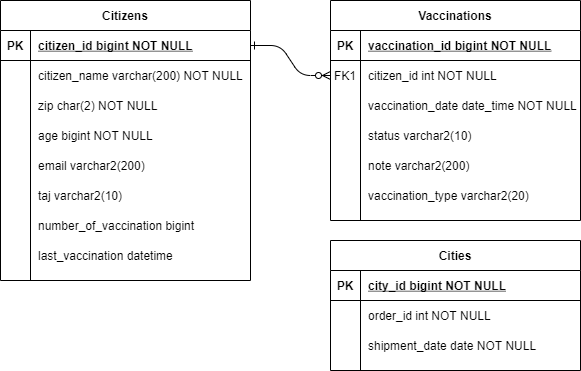

# Oltásokat kezelő alkalmazás

## Funkcionális leírás

A koronavírus elleni védekezésben az egyik leghatékonyabb eszközünk a vakcinák beadása.
Egy olyan valódi alkalmazást kell készítened, mely megszervezi az oltásokat.
Az alkalmazás konzolos felülettel, és relációs adatbázissal rendelkezik (MariaDB).

Az üzleti folyamat a következő lépésekből áll:

Az állampolgár regisztrálja magát az oltásra. A következő adatokat kell megadnia:

* Teljes név
* Irányítószám
* Életkor
* E-mail cím
* TAJ száma

Amikor regisztrálja magát, a következőket kell megvalósítani:

* Ellenőrizzük, a név nem lehet üres
* Ha beírja az irányítószámát, akkor írjuk ki a hozzá tartozó települést
* Ha az irányítószám üres, hibaüzenetet kell kiírni
* Az életkor > 10 és < 150.
* Az e-mail cím legyen formaliag helyes, elegendő, ha legalább 3 karakter, és van benne egy `@` karakter
* Az e-mail címét kétszer kell megadni, és másodjára is ugyanazt a címet kell megadni
* A TAJ számot CDV ellenőrzésnek kell alávetni

Az irányítószámokhoz tartozó települések megtalálhatóak ebben az állományban:

https://github.com/Training360/strukturavalto-java-public/blob/master/examples/week13d01/src/main/resources/iranyitoszamok-varosok-2021.csv

(Ezt importáld be egy táblába, HeidiSQL Tools/Import CSV fájl... menüpont felhasználásával!)

A CDV ellenőrzés algoritmusa:

> A TAJ szám első nyolc számjegyéből a páratlan helyen állókat hárommal, a páros helyen állókat héttel szorozzuk, és a szorzatokat összeadjuk. 
> Az összeget tízzel elosztva a maradékot tekintjük a kilencedik, azaz CDV kódnak.

A regisztrációkat tömegesen is be lehet adni egy CSV állományban. Erre azért van szükség, mert egy idősotthonban nem regisztrálja be
mindenki saját magát, hanem egyszerre regisztrálják be őket, automatikusan.

A szöveges állomány a formátuma a következő (az első rész a fejléc):

```
Név;Irányítószám;Életkor;E-mail cím;TAJ szám
John Doe;2061;60;john.doe@example.com;1234567890
Jane Doe;2091;40;jane.doe@example.com;1234567881
```

Ilyen fájlt generálhatsz a következő címen:

https://mockaroo.com/

A második lépésként ki kell generálni irányítószámonként az oltások
listáját egy fájlba. Mivel az idősebbek veszélyeztetettebbek, ezért
életkor szerint kell a még nem beoltottakat sorba rendezni, 
utána pedig név szerint. Mivel óránként 2 ember tudnak csak beoltani,
ezért az első 16 ember adatait kell csak kiírni.
Valamint azokat kell csak behívni, akiknek még nem volt oltása,
vagy volt oltása, azonban már eltelt 15 nap.

A fájl formátuma:

```
Időpont;Név;Irányítószám;Életkor;E-mail cím;TAJ szám
8:00;John Doe;2061;60;john.doe@example.com;1234567890
8:30;Jack Doe;2061;40;jack.doe@example.com;1234567881
```

Látható, hogy az időpontot is bele kell generálni. (8:00-tól 16:00-ig, félórás időközökkel)

A következő lépésben megtörténik az első oltás.
Az oltás elvégzéséhez meg kell adni a TAJ számot, a dátumot és az oltóanyag típusát.

Ha a TAJ szám érvénytelen, vagy nincs rá regisztráció, hibaüzenetet kell kiírni.

Azonban az oltás meg is hiúsulhat. Pl. az állampolgár visszautasítja, olyan betegsége van, várandós, stb. Ezt is rögzíteni kell a rendszerben
a TAJ szám, dátum és indoklás megadásával.

A következő lépésben megtörténik az második oltás.
Ugyanazokat az adatokat kell megadni. Azonban itt arra is figyelni kell, hogy az előző
oltás óta 15 napnak el kell telnie.
Valamint ki kell írnia az előző oldás gyártóját, mert csak ugyanazzal lehet beoltani.

Az alkalmazásba kell egy riportot is megvalósítani, ami kiírja, hogy irányítószámonként
hány beoltatlan, egyszer és kétszer beoltott állampolgár van.

## Technológiai javaslatok

## Adatbázis

Az adatbázissal kapcsolatban azt javaslom, hogy a regisztráció táblában legyen eltárolva, hogy
hány vakcinát adtak be, és mikor volt az utolsó beadása. És ezt kell update-elni. Ekkor
nem kell joinolni, egyszerűbbé válnak a lekérdezések.



## Felhasználói felület

Természetesen egy konzolos alkalmazást kell készíteni.
Először legyen egy menü:

```
1. Regisztráció
2. Tömeges regisztráció
3. Generálás
4. Oltás
5. Oltás meghiúsulás
6. Riport
```

A menüpontok rendre:

* Regisztráció: kérje be sorban az adatokat, ahol hiba van, azonnal jelezze ki. A regisztrációt vegye fel `citizens` táblába.
* Tömeges regisztráció: kérje be a fájl elérési útvonalát, ha nincs ott, vagy hibás a fájl, akkor írjon ki hibaüzenetet, amúgy töltse be a `citizens` táblába
* Generálás: kérje be az irányítószámot, majd a fájlt, amilyen néven el kell menteni
* Oltás: be kell kérni a TAJ számot. Le kell kérdezni, hogy volt-e már oldása. Ha nem volt, akkor be kell kérni a dátumot és a típust. Ha már volt egy,
 akkor ki kell írni, hogy mikor és milyen vakcinával. Majd be kell írni a dátumot. Ha már kettő volt neki, akkor hibaüzenetet kell kiírni.
* Oltás meghiúsulás: be kell írni a TAJ számot, majd a meghiúsulás okát.

## Osztályok

TBD

## Tesztesetek

Írj!