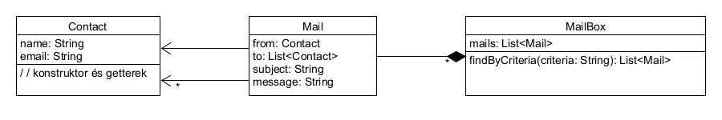

# Vizsgafeladat

A feladatok megoldásához az IDEA fejlesztőeszközt használd! 
Bármely régebbi osztályt megnyithatsz.
A feladatok megoldásához ajánlom figyelembe a cheet sheetet:

https://github.com/Training360/strukturavalto-java-public/blob/master/cheet-sheet/cheet-sheet.md

Először másold át magadhoz a teszteseteket, majd commitolj azonnal!

A három feladatra 1,5 órád van összesen!

Oldd meg a feladatokat, minden feladat megoldását egy külön commitban
add be!
Ha letelik a másfél óra az első commitodhoz képest és nem fejezted be, megint commitolj, akkor is,
ha nem vagy kész! Utána nyugodtan folytathatod a megoldást, akár több órát is
ülhetsz felette, ha kész vagy, commitolj!

## Pontozás

A feladatokra 10-15-15 pont adható.

A vizsgatevékenység akkor eredményes, ha a vizsgázó a megszerezhető összes
pontszám legalább 51 %-át elérte. 

## CDV

Írj egy `CdvCheck.check()` metódust (paraméterezése, visszatérési értéke kiderül a tesztesetből), 
mely kap egy adószámot, és eldönti róla,
hogy helyes-e!
A következőképp kell eldönteni. Fogni kell az első kilenc számjegyet,
és megszorozni rendre 1, 2, ..., 9 számmal. Az eredményt kell összegezni,
majd maradékos osztani 11-el. A 10. számjegynek meg kell egyeznie
ezzel a számmal (maradékkal).

Pl.: 

```
8365670003
1 * 8 + 2 * 3 + 3 * 6 + ... + 9 * 0 = 124
124 maradékos osztás 11-el = 3
3 (maradék) == 3 (10. számhegy) - az adószám megfelelő 
```

Ha a paraméterként átadott adószám nem 10 számjegy, vagy nem csak
számjegy szerepel benne, `IllegalArgumentException` kivételt kell dobni.

## Bagolyszámlálás

A `OwlCounter` oszály egy `Map<String, Integer>` attribútumban tárolja, hogy
melyik megyében mennyi baglyot számoltak a madárszámlálók.
A `readFromFile()` metódussal (paraméterezése, visszatérési értéke kiderül a tesztesetből)
töltsd be az értékeket egy fájlból! A fájl formátuma a következő:

```
Bács-Kiskun=1000
Baranya=1050
Békés=980
Borsod-Abaúj-Zemplén=600
```

A `getNumberOfOwls()` metódus adja vissza a baglyok számát a paraméterként átadott
megyében!

## Levelezés

Egy levelet egy `Mail` osztály tárol, a következő attribútumokkal: feladó, címzettek, tárgy és
szöveg. A feladót és a címzetteket egy `Contract` tárol, melynek két attribútuma van:
viselt név és e-mail cím.
A `MailBox` tárolja a leveleket egy `Mail` listában. Ennek legyen egy `findByCriteria()`
metódusa, mely paraméterként egy keresési feltételt vár, és leveleket ad vissza.

A keresési feltételek lehetnek:

* `from:John Doe` vagy `from:johndoe@example.com` - `from:` előtaggal visszaadja az összes olyan
levelet, ahol a feladó neve vagy e-mail címe pontosan a `from:` után szereplő szöveg   
* `to:John Doe` vagy `to:johndoe@example.com` - `from:` előtaggal visszaadja az összes olyan
levelet, ahol a címzettek között szerepel olyan, akinek a neve vagy e-mail címe pontosan a `to:` után szereplő szöveg
* egyéb esetben visszaadja az összes olyan levelet, amiben szerepel a tárgyban vagy üzenetben a megadott szó

   
