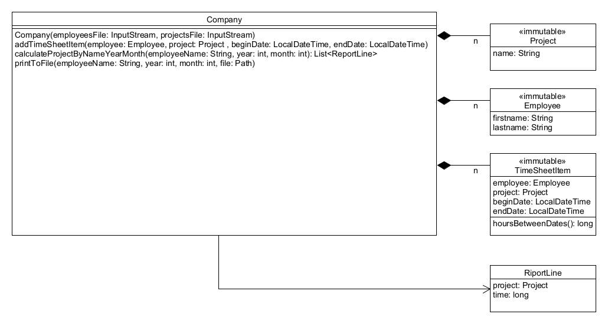

# Timesheet projekt

A feladatban egy cég munkaidő nyilvántartását kell megvalósítani. A cégen belül
vannak alkalmazottak illetve projektek. A cél, hogy az egyes alkalmazottak, egyes projekteken
végzett munkaidejét megfelelő formátumban egy fájlba kiírjuk. A várt formátumot megtalálod a tesztesetek adatai között.



## Részletes leírás

A `timesheet` csomagba dolgozz! A `Company` osztály tartalmazza
a projekteket, alkalmazottakat, valamint annak listáját, hogy ki min mettől-meddig dolgozott.
A projekteket és alkalmazottak neveit egy-egy fájlból kell beolvasni a konstruktorban, (alkalmazottnál vezeték-, keresztnevet külön-külön).

Az `addTimeSheetItem` metódusban lehet új elemet felvenni.
Fontos, hogy itt az időpontok mindig egy napra essenek, valamint a mikortól korábbi időpont legyen
mint a meddig. Ilyen elemeket bármikor hozzáadhatunk a nyilvántartáshoz. Ezeket a `TimeSheetItem`
konstruktorában kell ellenőrizni.

A következőképp lehet ellenőrizni, hogy két időpont ugyanarra a napra esik-e:

```java
beginDate.toLocalDate().equals(endDate.toLocalDate())
```

Így lehet ellenőrizni, hogy az egyik dátum a másik dátum után van-e:

```java
beginDate.isAfter(endDate)
```

A `TimeSheetItem` osztályban érdemes megvalósítani a `hoursBetweenDates()` metódust is.
Két dátum között eltelt órák számát a következőképp lehet kiszámítani:

```java
Duration.between(beginDate, endDate).toHours()
```

A `LocalDateTime` objektumtól az évet a `beginDate.getYear()`, a hónapot a
`beginDate.getMonthValue()` metódussal lehet lekérni.

A `calculateProjectByNameYearMonth()` metódus adja vissza, hogy az adott
alkalmazott az adott évben és hónapban melyik projekten mennyit dolgozott.

A megfelelő projekt-óra párok kialakításához segítségedre lehet a `RiportLine` kiegészítő osztály és ezeket az elemeket
tárolhatod egy listában. Ezt a listát érdemes először összeállítani, ahol a megfelelő projekt ideje folyamatosan
növelhető. 

A `printToFile()` metódus írja ki az előző eredményét fájlba!
Fontos, hogy csak olyan alkalmazott adatait engedjük kiírni, aki valóban a cégnél dolgozik!
A projektek felsorolásánál csak azokat írjuk ki amin valóban dolgozott!

A fájl formátuma:

```plain
John Connor 2013-01 14
Java    10
C++ 4
```

Ez azt jelenti, hogy John Connor 2013 januárjában összesen 14 órát dolgozott,
ebből 10 órát a Java projekten, 4 órát a C# projekten.

Különösen ügyeljünk arra, hogy rövid metódusaink legyenek, és ne legyen benne blokkok egymásba
ágyazása két szintnél mélyebben!

<!-- [rating feedback=java-newtimesheet] -->

